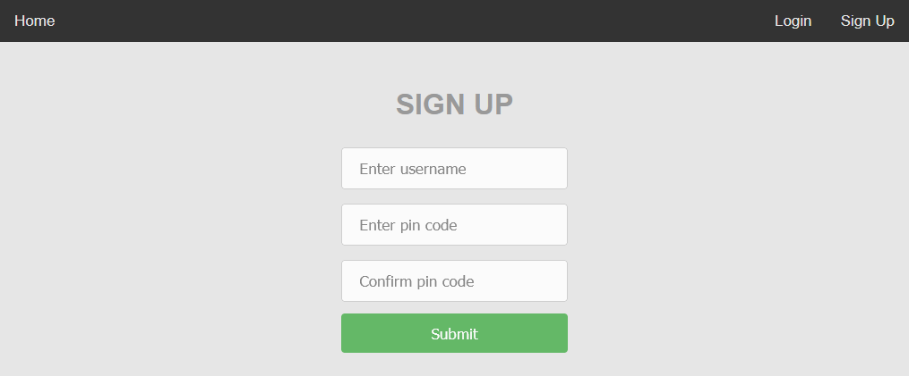
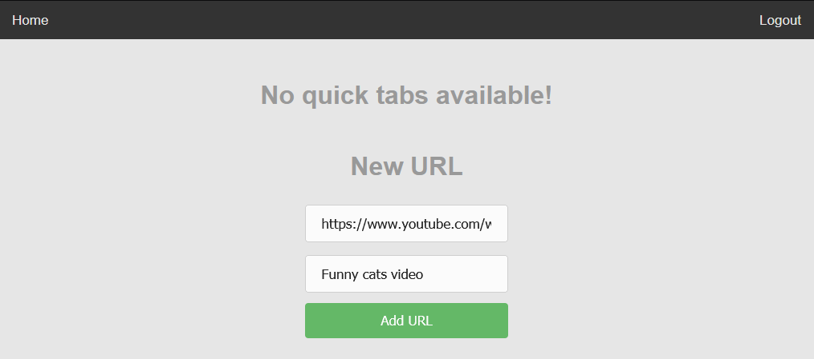
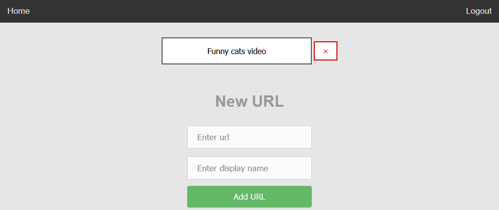

<h2>What is <i>GracefulServal</i></h2>  
Graceful Serval is a <i>bookmarks tool</i>, which helps to establish register of interesting or useful websites in you local network. It may be helpful for you, your family, friends, flatmates or even coworkers to keep helpful content in one place.  
  
<h2>About Serval</h2>  
Serval <i>(Felis serval)</i> is a long-legged African wildcat having large ears and a tawny black-spotted coat. Servals are extinction threatened, but only 9 out of 42 countries, where servals occur, have banned hunting for their leather.
On many European e-commerce websites there is possibility to find offers for buying servals as pets.
This animal was chosen as mascot for this project to raise awareness, that even if international law prohibits some actions, not all countries take care of animals, that are on edge of extinction, cause for many people lust for money is stronger than morality.
  
\
<i>source:</i> [Serval - Wikipedia](https://en.wikipedia.org/wiki/Serval)

<h3>Discontinuation note</h3>
This project is currently discontinued, because author has no further plans for application development. Similar projects may be started in the future, but as far as this note is available here, probably none did.

<h2>How to install</h2>
<h3>Prerequisites</h3>  
Python version: >= 3.7
  
Python modules (list available in requirements.txt):  
```
flask~=1.1.2  
Flask-SQLAlchemy  
Flask-Login  
Werkzeug~=1.0.1  
SQLAlchemy~=1.3.23  
requests~=2.25.1  
waitress  
```
  
See: [How to install modules](https://packaging.python.org/tutorials/installing-packages/#use-pip-for-installing) \
See: [How to install modules from requirements.txt](https://packaging.python.org/tutorials/installing-packages/#requirements-files)  


<h3>Docker container</h3>    
Get graceful_serval container with:
   
```  
docker run -d -p 8000:8000 --name graceful_serval mcieciora/graceful_serval:latest   
```
  
<h3>Step-by-step installation</h3>  

Supported OS: Ubuntu 20.04

<h4>1. Clone repository</h4>  

```
git clone https://github.com/mcieciora/GracefulServal.git
cd GracefulServal
```
<h4>2. Create service file in <i>/lib/systemd/system</i></h4>  

```
sudo nano /lib/systemd/system/graceful_serval.service
```

<h4>3. Write into <i>/lib/systemd/system</i></h4>  

```ini  
[Unit]  
Description=Graceful Serval Service  
After=multi-user.target  

[Service]  
Type=idle  
User=<YOUR_USER_NAME>  
Group=<YOUR_USER_GROUP>  
ExecStart=<PATH_TO_PYTHON> <PATH TO CLONED REPOSITORY>/main.py  
Restart=always  
  
[Install]  
WantedBy=multi-user.target  
```  
<h4>4. Set access rights</h4>  

```
sudo chmod 644 /lib/systemd/system/graceful_serval.service
```  
<h4>5. Start daemon </h4>  

```
sudo systemctl daemon-reload
sudo systemctl enable graceful_serval.service
```  
<h4>6. Reboot machine</h4>  

```
sudo reboot
```  
<h2>How to use</h2>  
<h3>Sing up</h3>  
  
First, you need to create account with username and pin code as a password. <b>Pin code shall be four digits long.</b> After submitting, you will be automatically redirected to Home page again, which now will contain url addition form.  
  
  
  
  
  
  
<h3>Add url</h3>  
  
To add bookmark simply copypaste your target website url and give it a short, but descriptive name.  
  

  
<h3>Url view</h3>  
  
Each authenticated user, by clicking red X button, has the ability to delete expired or unwanted urls.  
  
  
  
<h3>Guest user view</h3>  
  
For guest users main page contains only listed bookmarks.  
  
  
See: [Funny cats video ;)](https://www.youtube.com/watch?v=eX2qFMC8cFo)

<i>mcieciora</i>
